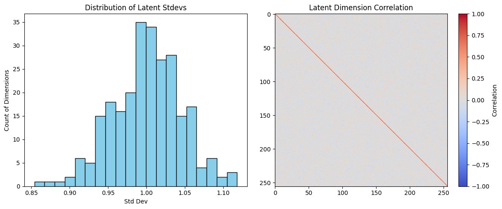
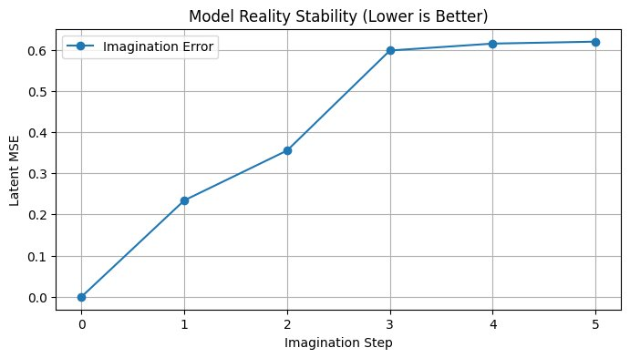
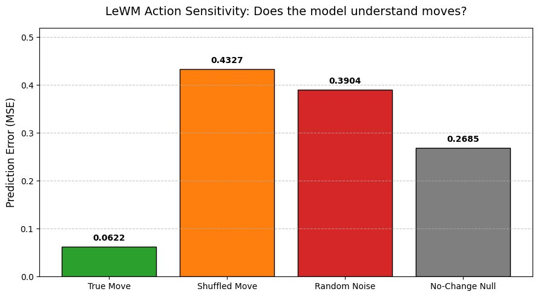

<div align="center">

# ♟ LeWM-Chess

### A latent world model that learns chess by *imagining* the future not by searching it.

[](https://www.python.org/)
[](https://pytorch.org/)
[](LICENSE)
[-b31b1b)](https://arxiv.org/abs/2603.19312)

**[Interactive research report & live demos →](https://fanxvirat.github.io/lewm-chess/)**

*Built on the LeWM architecture and the JEPA world-model program (LeCun et al.),
trained end-to-end from raw **pixels** on ~1M positions from elite games.*

</div>

---

## What is this?

LeWM-Chess never sees a FEN string, a bitboard, or the rules of chess. It watches
**rendered board images**, embeds them into a 256-d latent space with a ViT encoder,
and learns an **action-conditioned autoregressive predictor** that answers one question:

> *"If this move is played, what will the world look like next?"*

A legality-masked policy head and a bounded value head ride on top of the same
latent space so the same representation that *imagines* futures also *acts*.
This is a chess-scale testbed for the JEPA/world-model thesis: predict in
representation space, not pixel space, and plan inside your own imagination.

## Headline results (epoch 10, 942k positions, single H100)

| Probe | Result | What it means |
|---|---:|---|
| **Legal move rate** | **100%** | Pure pixel-trained policy, never plays an illegal move |
| **Stockfish top-1 match** (d12) | **38%** | Agrees with Stockfish's best move 4/10 times |
| **Stockfish top-5 match** (d12) | **67%** | Stockfish's best move is in the model's top-5 |
| **Median Δcp of chosen move** | **12 cp** | The typical move costs ~0.1 pawns vs. optimal |
| **Causal planning gap** | **+0.370 MSE** | True move → 0.062 error; wrong move → 0.433. The model *uses* actions |
| **True vs. zero-action MSE ratio** | **7.6×** | Predictions collapse without the action signal |
| **Dead latent dimensions** | **0 / 256** | SIGReg keeps the embedding space fully alive |

<p align="center">
  
</p>

The model loses to full-strength Stockfish (see [`games/`](games) — both PGNs
included), but it plays *coherent theory from pixels alone*: in the depth-18 game it
opens with a textbook **Rossolimo Sicilian** (1.e4 c5 2.Nf3 Nc6 3.Bb5) and in the
depth-12 game a **Najdorf English Attack** structure (6.Be3 e5 7.Nb3) — opening
knowledge it was never told exists.

## Architecture

```
              ┌────────────────────────────  World Model  ───────────────────────────┐
              │                                                                       │
 128×128 px   │   ViT-Tiny        MLP proj          AdaLN-zero AR Predictor          │
 board frames ├──► encoder ──► (192→2048→256) ──►  8 × ConditionalBlock  ──► ẑ_{t+1} │
 (16-frame    │                     z_t  ▲          16 heads, residual drift         │
  windows)    │                          │                   ▲                       │
              │                          │                   │  action conditioning  │
 UCI move ────┼──► move embedding (20k vocab) ───────────────┘                       │
 + progress   │                                                                      │
              │        ┌─ policy head (legality-masked, 20k logits)                  │
              │  z_t ──┤                                                             │
              │        └─ value head (tanh-bounded WDL)                              │
              └──────────────────────────────────────────────────────────────────────┘
```

**v2 training objective** — five losses, engineered against the failure modes of
naive latent predictors:

| Component | Purpose |
|---|---|
| **Multi-step rollout loss** (K=4, γ=0.9) | Trains the *deployed* autoregressive computation; kills exposure bias. Error grows ≤ ε·(Lᵏ−1)/(L−1) |
| **Hutchinson Jacobian contraction penalty** | Pushes the latent map toward Lipschitz L ≤ 1 → linear, not exponential, rollout drift |
| **Scheduled sampling** (DAgger-style, 0 → 0.5) | The predictor trains on its *own* error distribution |
| **InfoNCE action contrast** | Different moves must produce distinguishable latent deltas the planner's signal |
| **SIGReg** (Epps–Pulley ECF statistic) | Anti-collapse regularizer; keeps all 256 dims Gaussian-healthy (0 dead dims, effective rank 30) |

Plus a legality-masked policy head and a tanh(cp/400)-style bounded value head.

## Training run

10k elite games → 942,240 positions → 46 GB uint8 mmap frame cache → 703k training
windows. 10 epochs, batch 256, bf16, fused AdamW, ~100% GPU utilization on one H100.

```
E001 | train loss 1.9096 pred 0.0479 pol_acc 0.016 nr 0.98 | val loss 3.6797 pred 0.0529 pol_acc 0.023 nr 0.97
E005 | train loss 0.9648 pred 0.0444 pol_acc 0.200 nr 0.98 | val loss 2.9334 pred 0.0463 pol_acc 0.153 nr 0.97
E010 | train loss 0.6513 pred 0.0595 pol_acc 0.419 nr 0.96 | val loss 2.4042 pred 0.0606 pol_acc 0.200 nr 0.96
```

`nr` (norm ratio ≈ 1.0 throughout) is the key v2 health metric: the predictor does
**not** shrink toward the mean when rolled out on its own outputs the collapse
mode that kills naive latent world models.

## Quickstart

```bash
git clone https://github.com/fanXvirat/lewm-chess.git
cd lewm-chess
pip install -r requirements.txt

# 1. Build the frame cache from the included PGN (renders every position once)
python train.py --mode build-cache --pgn chessgames.pgn

# 2. Train (10 epochs, H100-tuned defaults)
python train.py --mode train --pgn chessgames.pgn --epochs 10 --batch-size 256

# 3. Stockfish-grounded evaluation (requires `apt install stockfish`)
python train.py --mode stockfish --ckpt outputs/lewm_chess_best.pt

# 4. World-model probes: action sensitivity, imagination drift, embedding health
python diagnostics.py --ckpt outputs/lewm_chess_best.pt

# 5. Play it against Stockfish
python play.py --ckpt outputs/lewm_chess_best.pt --color white --depth 12
```

## Repository layout

```
.
├── train.py            # single-file model + losses + training + eval (H100-ready)
├── play.py             # LeWM vs Stockfish match runner → PGN
├── diagnostics.py      # world-model probes (causality, drift, embedding health)
├── chessgames.pgn      # training corpus (elite games)
├── games/              # actual games played by the trained model
├── notebooks/          # full evaluation notebook with all experiments
├── assets/             # result figures
└── docs/               # interactive research report (GitHub Pages)
```

## Evidence it's a *world* model, not a move classifier

1. **Action causality** — replacing the true move with a different *legal* move
   explodes prediction error 7× (0.062 → 0.433 MSE). The dynamics are conditioned
   on actions, not memorized trajectories.
2. **Counterfactual ordering** — wrong-but-legal moves hurt *more* than pure noise
   (0.433 vs 0.390): the model has learned the manifold of plausible futures, and a
   coherent-but-false premise drags imagination further off course than garbage it
   can ignore.
3. **Closed-loop stability** — imagination drift saturates (~0.62 latent MSE) rather
   than diverging, thanks to the Jacobian contraction penalty.
4. **Healthy representation** — 0/256 dead dimensions, near-diagonal correlation
   matrix, effective rank 30.

<p align="center">
  
  
</p>

## Roadmap

- [ ] RL fine-tuning stage with tanh(cp/400) value targets (head already in place)
- [ ] Latent-space MCTS: plan by rolling out imagination instead of game rules
- [ ] Scale corpus to 10M+ positions / larger ViT encoder
- [ ] Pixel-space decoder for visualizing imagined futures

## Citation

```bibtex
@misc{lewmchess2026,
  author = {fanXvirat},
  title  = {LeWM-Chess: A Latent World Model for Chess from Pixels},
  year   = {2026},
  url    = {https://github.com/fanXvirat/lewm-chess}
}
```

Built on **LeWM** ([arXiv:2603.19312](https://arxiv.org/abs/2603.19312)) and the
JEPA world-model program of Yann LeCun et al.

## License

MIT — see [LICENSE](LICENSE).
